# README - Mô tả chi tiết bộ bài Seminar chuyên đề

## Thông tin thực hiện
- Giảng viên hướng dẫn: TS. Đỗ Như Tài
- Sinh viên thực hiện:
    + Trịnh Long Phát - 3122411150
    + Nguyễn Phương Vinh - 3122411247
    + Ngô Tuấn Anh - 3122411007
    + Trần Hảo Điền - 3122411042
- Lớp: DCT122C3
- Môn học: Seminar chuyên đề

## 1) Tổng quan
Thư mục này chứa 8 tệp bài tập/chuyên đề theo tiến trình học từ nền tảng GenAI, AI Agent, đến thiết kế và triển khai hệ thống Microservice.

Danh sách 8 file gốc:
1. `BT1_VibeCopiplot_TrinhLongPhat_3122411150.zip`
2. `Bai2_AiAgent_TrinhLongPhat_3122411150.zip`
3. `BT03-Tong-quan-kien-truc-phan-mem.docx`
4. `Bai04_CodingGenAI_TrinhLongPhat_3122411150.zip`
5. `Bai05_AdvCodingGenAI_TrinhLongPhat_3122411150.zip`
6. `Bai06_ProductionGenAI_TrinhLongPhat_3122411150.zip.7z`
7. `Bai07_MicroserviceArchitecture_TrinhLongPhat_3122411150.7z`
8. `Bai08_Microservice_Vibe_Engineering_TrinhLongPhat_3122411150.7z`

### Diagram tổng thể lộ trình học
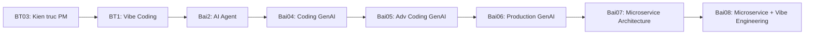

### Biểu đồ phân bổ định dạng tệp
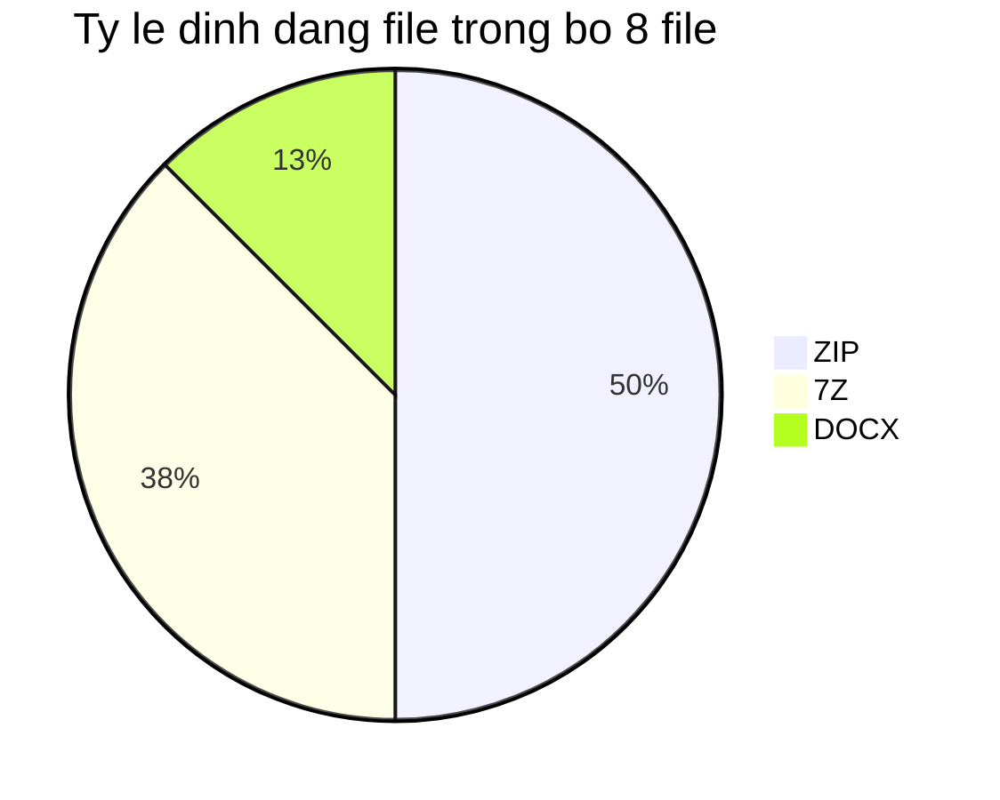

## 2) Bảng tổng hợp nhanh

| STT | File | Dung lượng xấp xỉ | Định dạng | Phạm vi nội dung |
|---|---|---:|---|---|
| 1 | `BT1_VibeCopiplot_TrinhLongPhat_3122411150.zip` | ~79 MB | ZIP | Workshop vibe coding đa ngôn ngữ, có mã nguồn + bản hoàn chỉnh + tài liệu bài. |
| 2 | `Bai2_AiAgent_TrinhLongPhat_3122411150.zip` | ~5.7 MB | ZIP | Hồ sơ bài AI Agent dạng báo cáo và slide thuyết trình. |
| 3 | `BT03-Tong-quan-kien-truc-phan-mem.docx` | ~186 KB | DOCX | Báo cáo lý thuyết kiến trúc phần mềm. |
| 4 | `Bai04_CodingGenAI_TrinhLongPhat_3122411150.zip` | ~4.2 MB | ZIP | Bài cơ sở lập trình GenAI, gồm tài liệu + mã lab đóng gói lồng nhau. |
| 5 | `Bai05_AdvCodingGenAI_TrinhLongPhat_3122411150.zip` | ~15 MB | ZIP | Bài nâng cao GenAI: prompt engineering, CoT/chaining, dữ liệu, notebook, Docker. |
| 6 | `Bai06_ProductionGenAI_TrinhLongPhat_3122411150.zip.7z` | ~7.0 MB | 7z | Tập trung production hóa GenAI: refactor, profiling, chuẩn hóa tài liệu. |
| 7 | `Bai07_MicroserviceArchitecture_TrinhLongPhat_3122411150.7z` | ~85 MB | 7z | Dự án microservice Java Spring Boot đầy đủ service lõi + docker compose. |
| 8 | `Bai08_Microservice_Vibe_Engineering_TrinhLongPhat_3122411150.7z` | ~3.6 MB | 7z | Hệ thống mở rộng gồm BE microservices + FE React + CI/CD + K8s + báo cáo. |

## 3) Mô tả chi tiết từng file

### 3.1) `BT1_VibeCopiplot_TrinhLongPhat_3122411150.zip`
- Vai trò trong lộ trình học:
  - Bài khởi động về tư duy "vibe coding" và cách sử dụng trợ lý code trong thực hành.
  - Tạo nền tảng để so sánh cách triển khai cùng một nghiệp vụ ở nhiều stack.
- Cấu trúc chính đã kiểm tra:
  - Thư mục gốc: `github-copilot-vibe-coding-workshop/`.
  - Các nhánh công nghệ: `dotnet/`, `java/`, `python/`, `javascript/`.
  - Nhánh đối chiếu hoàn chỉnh: `complete/`.
  - Tài liệu đính kèm: `Bai01.docx`, nhiều `README.md` theo từng ngôn ngữ.
  - Có thêm thư mục `localisation/` phục vụ bản dịch tài liệu.
- Thành phần kỹ thuật đáng chú ý:
  - `.NET`: có file `Contoso.BlazorApp.csproj`, cấu trúc ứng dụng Blazor.
  - `Java`: có `application.properties`, cho thấy dùng cấu hình chuẩn Spring.
  - `JavaScript`: có `package.json`, Dockerfile trong bản hoàn chỉnh.
  - `Python`: có README theo bài thực hành.
- Giá trị học thuật:
  - Phù hợp để so sánh tư duy kiến trúc và tổ chức project giữa nhiều hệ sinh thái.
  - Có thể dùng để trình bày quy trình: đề bài -> mã nháp -> bản hoàn thiện.

#### Hình ảnh minh họa


#### Sơ đồ tổng quan
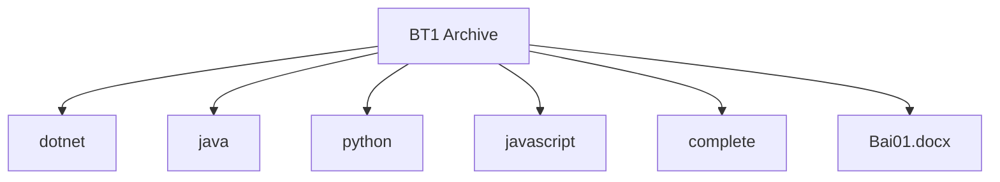

#### Sơ đồ kiến trúc hệ thống
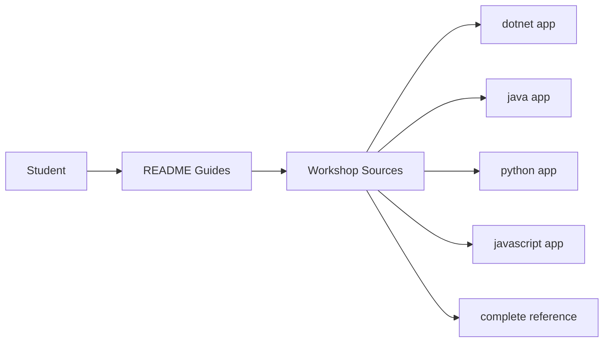

#### Biểu đồ thành phần
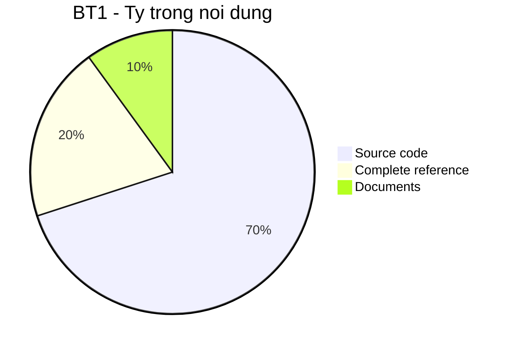

### 3.2) `Bai2_AiAgent_TrinhLongPhat_3122411150.zip`
- Vai trò trong lộ trình học:
  - Chuyển trọng tâm từ coding thuần sang thiết kế quy trình AI Agent.
  - Nhấn mạnh luồng hội thoại và tổ chức workflow cho chatbot hỏi đáp.
- Thành phần bên trong:
  - `Bai02_AIAgent_TrinhLongPhat_3122411150.docx`.
  - `Presentation - Workflow Chatbot Hỏi Đáp.pptx`.
- Giá trị sử dụng:
  - Thuận tiện cho buổi thuyết trình vì đã có cặp tài liệu chuẩn: báo cáo + slide.
  - Dễ chuẩn hóa thành sản phẩm nộp học phần hoặc seminar nhóm.

#### Hình ảnh minh họa


#### Sơ đồ tổng quan
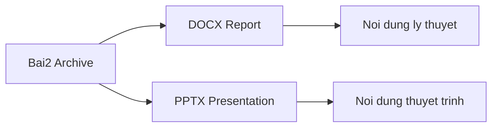

#### Sơ đồ kiến trúc hệ thống
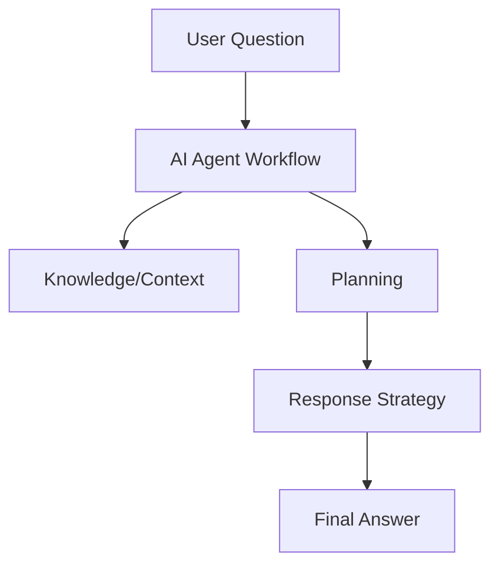

#### Biểu đồ thành phần
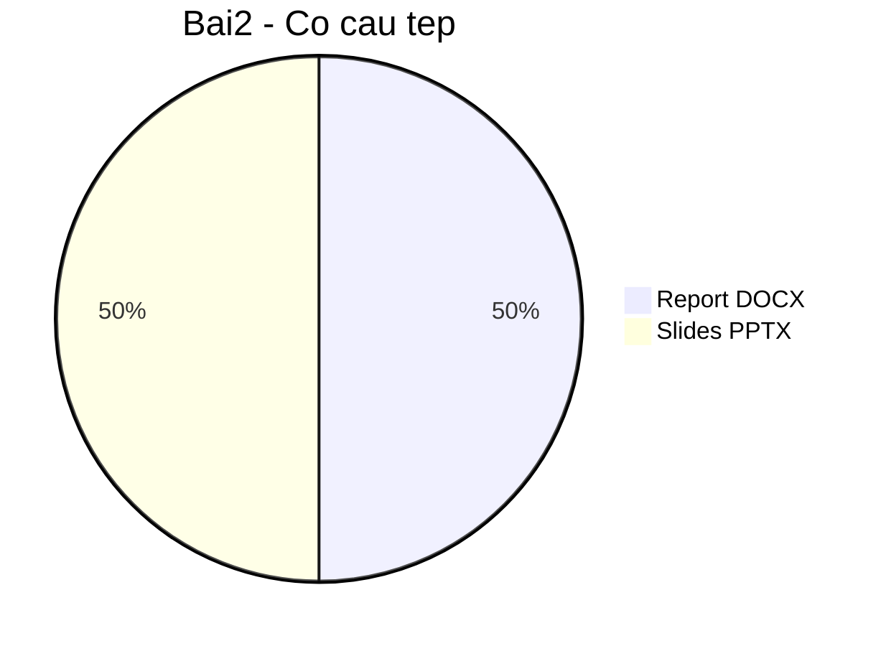

### 3.3) `BT03-Tong-quan-kien-truc-phan-mem.docx`
- Vai trò trong lộ trình học:
  - Bài nền tảng lý thuyết trước khi đi vào microservice thực chiến.
  - Giúp liên kết các khái niệm như module, coupling, scalability với các bài sau.
- Đặc điểm file:
  - File độc lập định dạng `.docx`, không chứa mã nguồn.
  - Dung lượng nhỏ, phù hợp dạng báo cáo tổng hợp hoặc phân tích khái niệm.
- Khai thác thực tế:
  - Có thể dùng làm phần "cơ sở lý thuyết" khi viết báo cáo Bài 7 và Bài 8.

#### Hình ảnh minh họa


#### Sơ đồ tổng quan
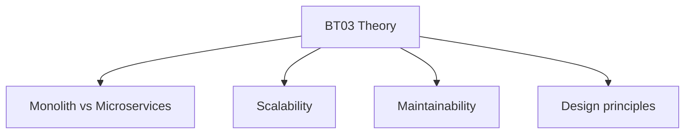

#### Sơ đồ kiến trúc hệ thống
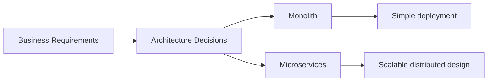

#### Biểu đồ trọng tâm nội dung
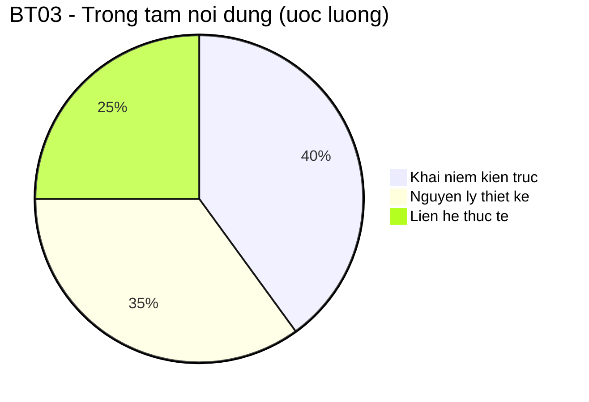

### 3.4) `Bai04_CodingGenAI_TrinhLongPhat_3122411150.zip`
- Vai trò trong lộ trình học:
  - Bài cơ sở lập trình với GenAI, tập trung thực hành qua các lab nhỏ.
- Thành phần cấp 1:
  - `[Bài 04] Cơ sở lập trình với GenAI.docx`.
  - `[Bài 04] Cơ sở lập trình với GenAI.pptx`.
  - `genAI.zip` (gói mã nguồn thực hành bên trong).
- Thành phần trong `genAI.zip`:
  - `GenAI/Lab 2/`: `lab21.py`, `lab22.py`, `lab23.py`, `.env`.
  - `GenAI/Lab 3/`: `lab31.py`, `lab32.py`, `lab33.ipynb`.
  - `GenAI/Lab 4/`: `lab42.py`, `lab41.txt`, `lab42.txt`.
  - `GenAI/Lab_5/`: `5_1.py`, `5_1.txt`, `5_2.py`.
- Giá trị sử dụng:
  - Dễ học theo kiểu "đọc tài liệu -> xem slide -> chạy lab" trong cùng một gói.

#### Hình ảnh minh họa


#### Sơ đồ tổng quan
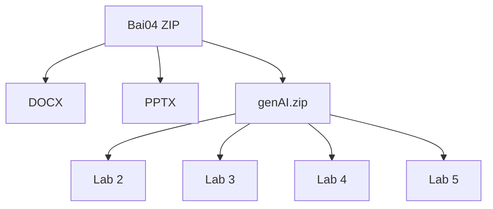

#### Sơ đồ kiến trúc hệ thống
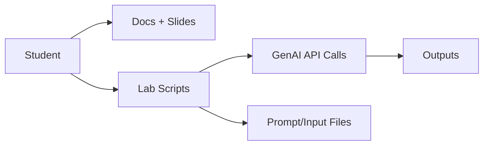

#### Biểu đồ thành phần lab
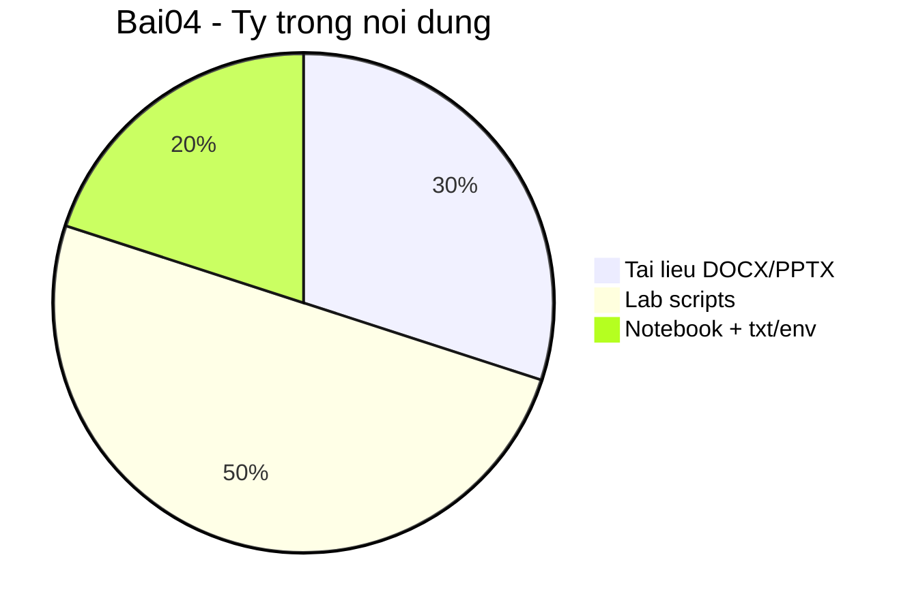

### 3.5) `Bai05_AdvCodingGenAI_TrinhLongPhat_3122411150.zip`
- Vai trò trong lộ trình học:
  - Bài nâng cao, mở rộng từ Bài 4 sang kỹ thuật prompt và tối ưu code bằng GenAI.
- Cấu trúc nội dung chính:
  - `Chap 6/ch6/`: dữ liệu Reuters, notebook, file thống kê.
  - `Chap 7/`: `app.py`, `requirements.txt`, `Dockerfile`, `prompts/`.
  - `chapter 9/`: baseline, chain-of-thought, chaining.
  - `Chapter 10/`, `Chapter 11/`: các lab về baseline/prompt/performance.
  - `Lab_8/`: script thực nghiệm prompt.
  - Có tài liệu docx + slide tổng hợp.
- Điểm kỹ thuật nổi bật:
  - Có script, notebook, dữ liệu, prompt mẫu và Dockerfile trong cùng một gói.

#### Hình ảnh minh họa


#### Sơ đồ tổng quan
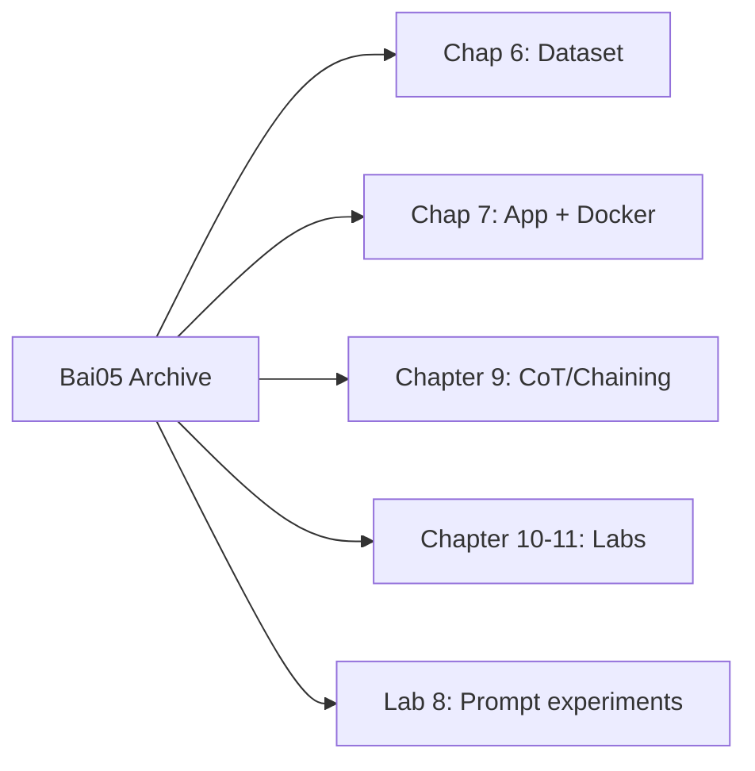

#### Sơ đồ kiến trúc hệ thống
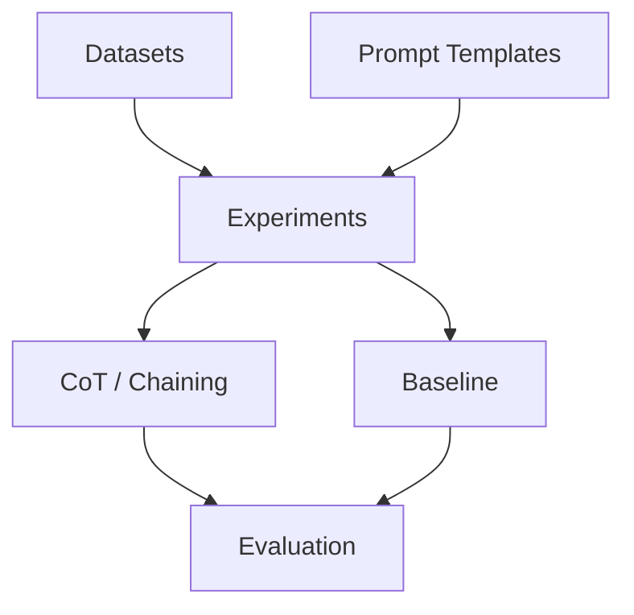

#### Biểu đồ phân bổ nội dung
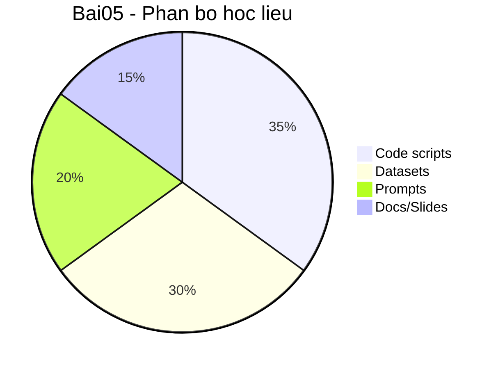

### 3.6) `Bai06_ProductionGenAI_TrinhLongPhat_3122411150.zip.7z`
- Vai trò trong lộ trình học:
  - Bước nối từ kỹ thuật lập trình GenAI sang yêu cầu triển khai thực tế.
- Đặc điểm đóng gói:
  - Định dạng `.zip.7z` (gói 7z chứa thư mục có hậu tố zip).
  - Tập trung vào 3 chapter chính + tài liệu tổng kết.
- Cấu trúc nội dung:
  - `Chapter 12/`: refactor Flask, chuẩn hóa docstring, review code.
  - `Chapter 14/`: profiling runtime/space, prompt tối ưu hiệu năng.
  - `Chapter 15/`: lab tổng hợp.
  - Có `docx` và `pptx` kết luận.

#### Hình ảnh minh họa


#### Sơ đồ tổng quan
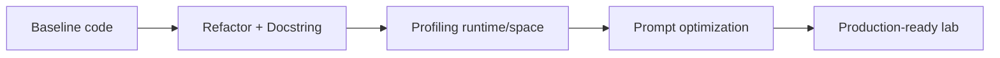

#### Sơ đồ kiến trúc hệ thống
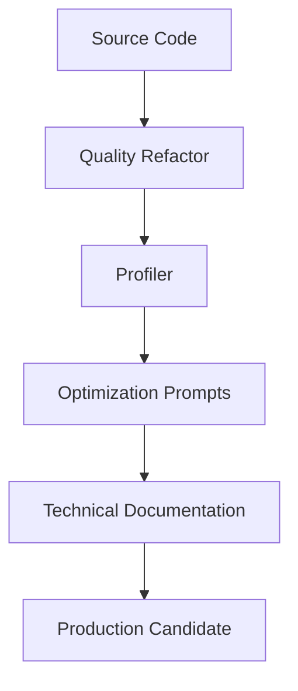

#### Biểu đồ trọng tâm bài
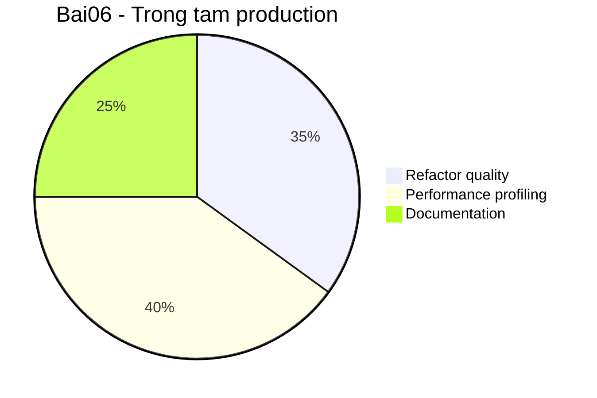

### 3.7) `Bai07_MicroserviceArchitecture_TrinhLongPhat_3122411150.7z`
- Vai trò trong lộ trình học:
  - Bài kiến trúc microservice trọng tâm, chuyển từ AI coding sang hệ thống phân tán.
- Cấu trúc dự án:
  - `discovery-server`, `api-gateway`, `product-service`, `order-service`, `inventory-service`, `notification-service`.
  - `docker-compose.yml`, `pom.xml`, Dockerfile theo service.
- Thành phần mã nguồn:
  - Có `src/main`, `src/test`, `application.properties`, và các tầng controller/service/repository/dto/config.
- Ghi chú hiện trạng:
  - Có thư mục `target/` thể hiện dự án đã từng build trước khi nén.

#### Hình ảnh minh họa


#### Sơ đồ tổng quan
```mermaid
flowchart TD
    C[Client] --> G[API Gateway]
    G --> P[Product Service]
    G --> O[Order Service]
    G --> I[Inventory Service]
    G --> N[Notification Service]
    P --> D[Discovery Server]
    O --> D
    I --> D
    N --> D
```

#### Sơ đồ kiến trúc hệ thống
```mermaid
flowchart LR
    UI[Client/App] --> GW[Gateway]
    GW --> DS[Discovery Server]
    GW --> PS[Product Service]
    GW --> OS[Order Service]
    GW --> IS[Inventory Service]
    GW --> NS[Notification Service]
    OS --> MQ[(Message/Event)]
    NS --> MQ
```

#### Biểu đồ cơ cấu hệ thống
```mermaid
pie title Bai07 - Co cau thanh phan
    "Core microservices" : 60
    "Gateway + Discovery" : 20
    "Build/Config/Test assets" : 20
```

### 3.8) `Bai08_Microservice_Vibe_Engineering_TrinhLongPhat_3122411150.7z`
- Vai trò trong lộ trình học:
  - Bài tổng hợp cuối kỳ, mở rộng từ microservice sang hệ sinh thái triển khai hoàn chỉnh.
- Thành phần tài liệu:
  - `Tuan08.docx`, `Tuan08.pdf`, cùng nhiều PDF mô tả service.
- Thành phần backend:
  - `ProjectWeb-BE` gồm `api-gateway`, `eureka-server`, `user-service`, `product-service`, `order-service`, `payment-service`, `notification-service`.
  - Có `docker-compose.yml`, Dockerfile, `pom.xml`, `application.properties/yml`.
- Thành phần vận hành:
  - CI/CD: `.github/workflows/deploy.yml`.
  - Kubernetes: `k8s/*.yaml`, `kubeconfig-ci.yaml`.
- Thành phần frontend:
  - `ProjectWeb-main/FE/react-e-commerce` với `package.json`, `Dockerfile`, `README.md`.

#### Hình ảnh minh họa


#### Sơ đồ tổng quan
```mermaid
flowchart LR
    A[React Frontend] --> B[API Gateway]
    B --> C[Microservices Backend]
    C --> D[(Databases/Cache)]
    C --> E[CI/CD Pipeline]
    E --> F[Kubernetes Cluster]
```

#### Sơ đồ kiến trúc hệ thống
```mermaid
flowchart TD
    FE[React FE] --> AGW[API Gateway]
    AGW --> US[User Service]
    AGW --> PDS[Product Service]
    AGW --> ODS[Order Service]
    AGW --> PMS[Payment Service]
    AGW --> NTS[Notification Service]
    US --> DB1[(User DB)]
    PDS --> DB2[(Product DB)]
    ODS --> DB3[(Order DB)]
    PMS --> DB4[(Payment DB)]
    CICD[GitHub Actions] --> K8S[Kubernetes]
    K8S --> AGW
```

#### Biểu đồ mức độ hoàn thiện
```mermaid
pie title Bai08 - Pham vi du an
    "Backend services" : 40
    "Frontend" : 20
    "DevOps CI/CD + K8s" : 25
    "Reports and docs" : 15
```

## 4) Hướng dẫn mở/giải nén nhanh
- Mở `.docx`: Microsoft Word, Google Docs, LibreOffice.
- Mở `.pptx`: PowerPoint, Google Slides.
- Giải nén `.zip`:

```bash
unzip <ten-file>.zip -d <thu-muc-dich>
```

- Giải nén `.7z`:

```bash
7z x <ten-file>.7z -o<thu-muc-dich>
```

## 5) Gợi ý thứ tự đọc và trình bày seminar
1. Bắt đầu từ `BT03` để lấy nền kiến trúc phần mềm.
2. Đi theo tuyến GenAI: `BT1` -> `Bai2` -> `Bai04` -> `Bai05` -> `Bai06`.
3. Chuyển sang tuyến hệ thống: `Bai07` -> `Bai08`.
4. Dùng `Bai08` làm phần demo tổng kết vì có cả BE/FE/DevOps.

## 6) Gợi ý chuẩn bị trước khi nộp
- Kiểm tra lại khả năng giải nén của 7 file archive.
- Đảm bảo không thiếu file tài liệu quan trọng (`docx`, `pptx`, `pdf`).
- Nếu cần chấm chạy code, nên tách riêng bản không chứa thư mục build (`target/`, cache) để gọn hơn.
- Đồng bộ cách đặt tên file theo mẫu hiện có để tiện đối chiếu MSSV.
